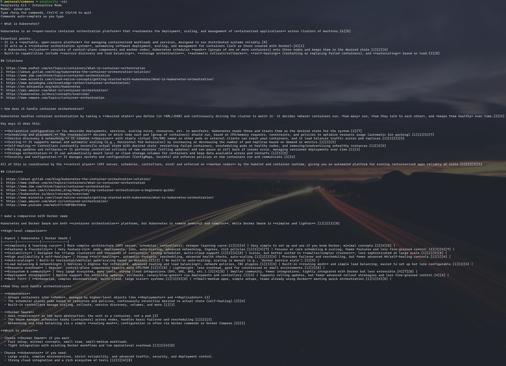

# Perplexity CLI

A command-line interface for the Perplexity API that brings AI-powered search and answers directly to your terminal.



## Features

- **Interactive Chat Mode** - Conversational interface with history and context
- **Real-time Streaming** - SSE-powered live response streaming
- **Formatted Output** - Rendered markdown with syntax highlighting
- **Multiple API Keys** - Automatic rotation on failure or rate limits
- **Token Statistics** - Optional usage tracking and citations
- **Cross-platform** - macOS, Linux, and Windows support

## Installation

### Quick Install

```bash
git clone https://github.com/quocvuong92/perplexity-cli.git
cd perplexity-cli
make install
```

### API Configuration

```bash
# Single key
export PERPLEXITY_API_KEY="your-api-key"

# Multiple keys (automatic rotation)
export PERPLEXITY_API_KEYS="key1,key2,key3"
```

Add to `~/.bashrc` or `~/.zshrc` for persistence.

## Quick Start

```bash
# Simple query
perplexity "What is quantum computing?"

# Streaming with rendered output
perplexity -sr "Explain relativity"

# Interactive mode
perplexity -i
```

## Options

| Flag | Description |
|------|-------------|
| `-i, --interactive` | Interactive chat mode with conversation history |
| `-s, --stream` | Stream output in real-time |
| `-r, --render` | Render markdown with colors and formatting |
| `-c, --citations` | Display citations |
| `-u, --usage` | Show token usage statistics |
| `-m, --model` | Choose model (default: sonar-pro) |
| `-a, --api-key` | Override API key |
| `-v, --verbose` | Enable verbose logging |

## Interactive Mode

Launch an interactive session with persistent conversation context:

```bash
perplexity -isr
```

### Available Commands

| Command | Action |
|---------|--------|
| `/exit`, `/quit`, `/q` | Exit session |
| `/clear`, `/c` | Reset conversation |
| `/model [name]` | Switch or show model |
| `/help`, `/h` | Display commands |

## Models

- `sonar-reasoning-pro` - Advanced reasoning capabilities
- `sonar-reasoning` - Standard reasoning model
- `sonar-pro` - Professional search (default)
- `sonar` - Base search model
- `sonar-deep-research` - Deep research analysis

## Building

```bash
make build          # Current platform
make build-darwin   # macOS (Universal)
make build-all      # All platforms
```

**Requirements:** Go 1.21+

## License

MIT License
